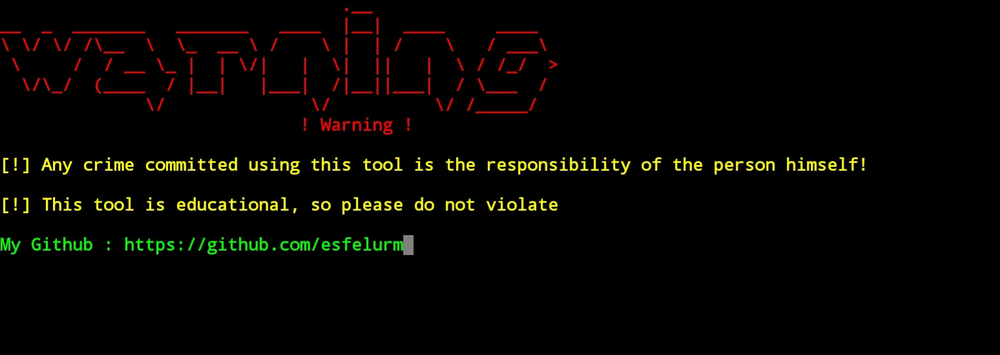
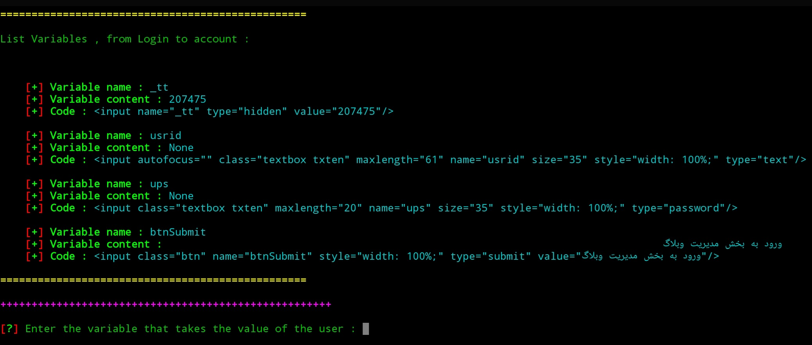

[](https://git.io/typing-svg) 

## Warning 👇🏻



##### With this tool, you can write a cracker for each login page + cracker development 


## Capabilities :


- Find the tags used in the login page + number of usage

- Find all site labels

- Finding site IDs and labels

- Finding suspicious labels to make crackers 👇🏻



## Note :

* `After making the crack tool, you can upgrade and customize it`

* `I made it so that you can see all the labels so that you can determine for yourself how to make the cracker`

## Support :

- Linux
- Windows
- Termux

## Installation 

```
git clone https://github.com/esfelurm/CMTES
cd CMTES
python CMTES.py
```

## Guide

<h4>When you give the page address <em>First, the tags used in the source + number of consumption </em>is showing</h4>

<h4>In the next value <em>Used and Variables & ID</em>displays </h4>

<h4>In the last amount <em>It displays suspicious and necessary labels for entry </em></h4>
